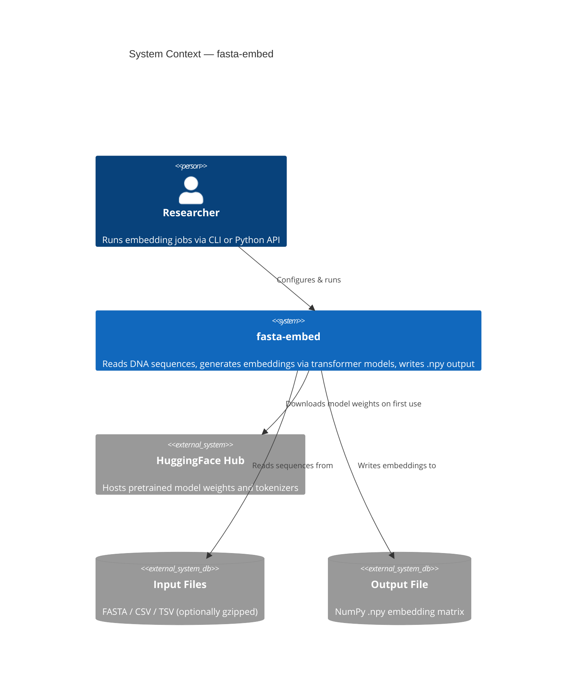
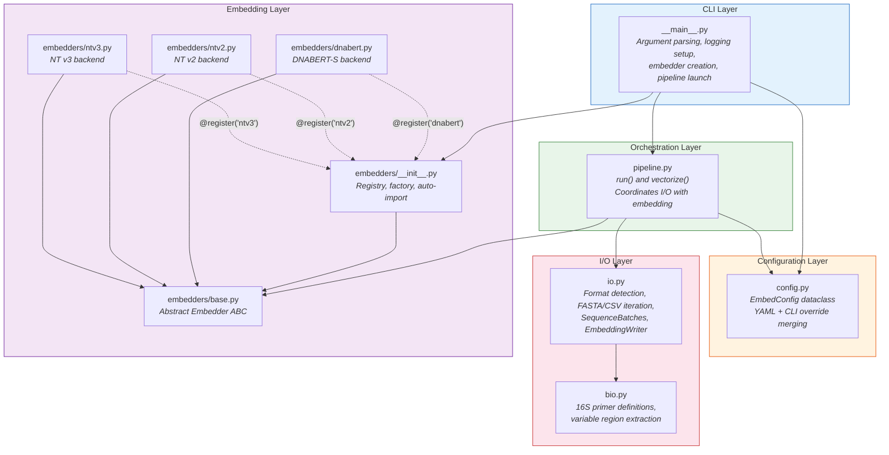
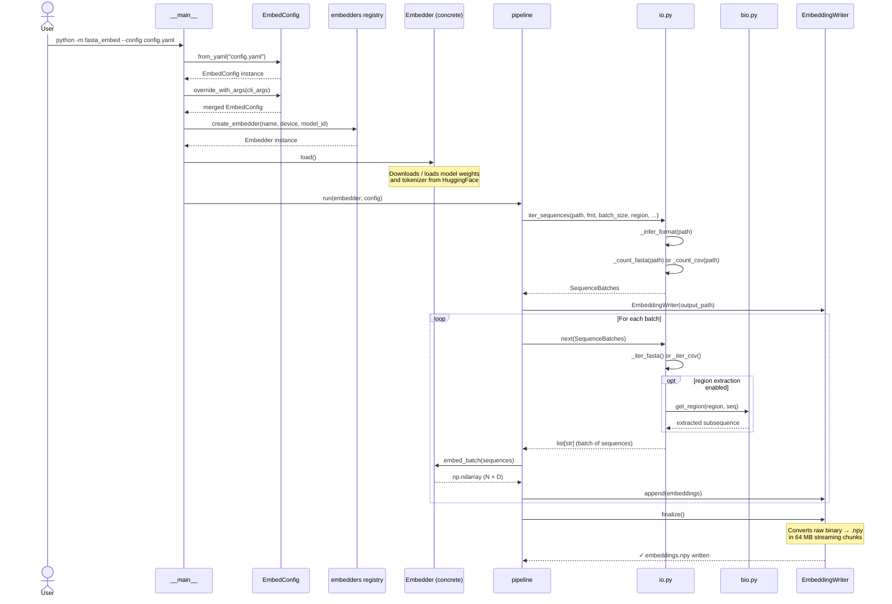

# Architecture Overview

## System Context

fasta-embed is a command-line tool and Python library that converts DNA sequences into dense vector embeddings using transformer-based language models. It reads sequences from FASTA or CSV files, optionally extracts 16S rRNA variable regions, generates embeddings in batches via a pluggable model backend, and streams the output to a NumPy `.npy` file.

---

## Module Map

The package is organized into five functional layers. Each layer has a single responsibility and communicates with adjacent layers through well-defined interfaces.

---

## Component Interaction Sequence

This diagram shows the runtime interaction between components during a typical embedding run.

---

## Key Design Decisions

| Decision | Rationale |
|---|---|
| **Registry pattern for embedders** | New backends are added by decorating a class with `@register("name")` — no factory switch statements to maintain. |
| **Streaming binary writer** | `EmbeddingWriter` appends raw bytes to a temp `.bin` file, then streams the final `.npy` header + data in 64 MB chunks. Peak memory stays constant regardless of dataset size. |
| **Two-pass sequence reading** | A fast counting pass (`_count_fasta` / `_count_csv`) runs first so `tqdm` gets an accurate total; the second pass iterates lazily. |
| **Config layering** | YAML provides reproducible defaults; CLI flags override individual values. The `override_with_args` method returns a new immutable config. |
| **Region extraction in the iterator** | 16S region extraction (`bio.get_region`) is applied lazily inside `SequenceBatches.__iter__`, avoiding a separate preprocessing step. |
