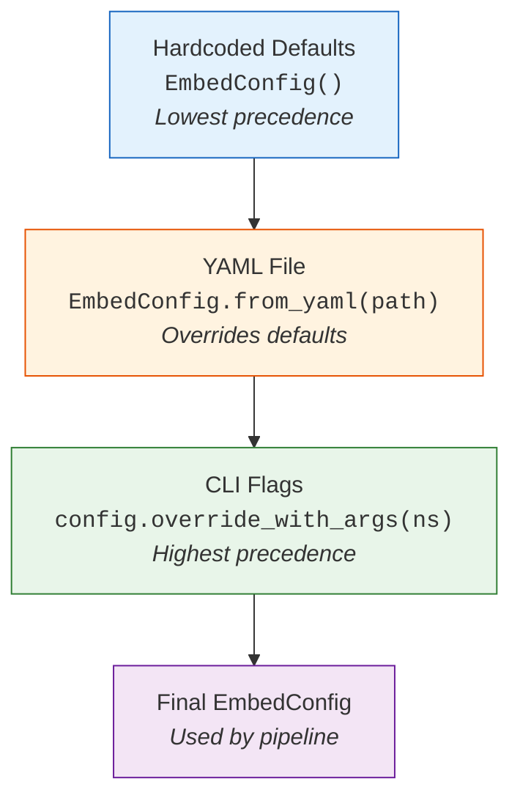
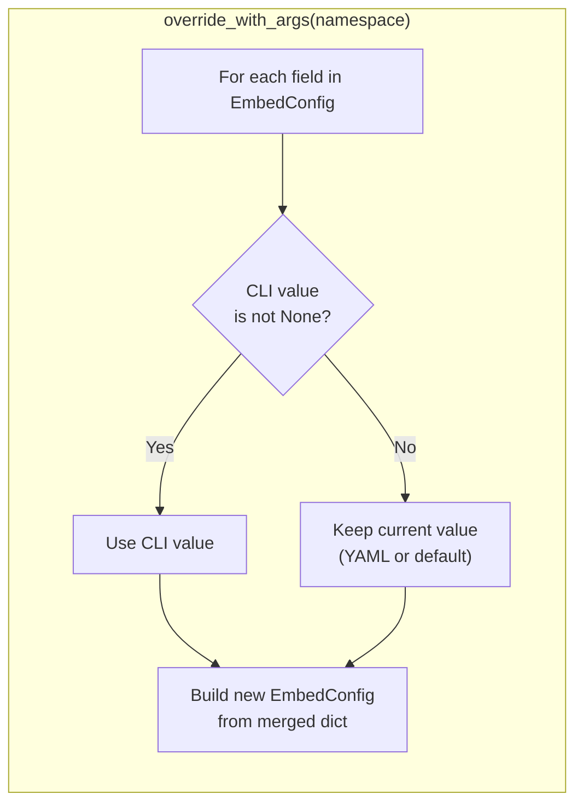
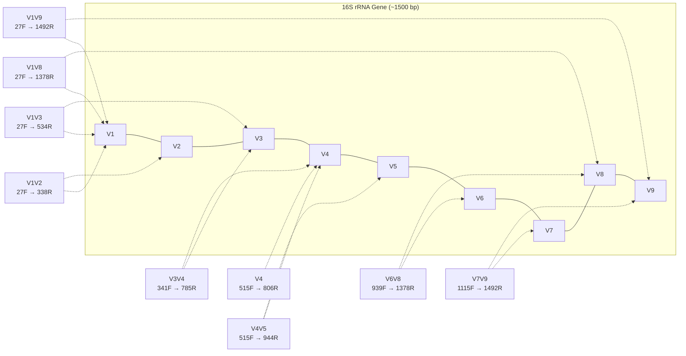
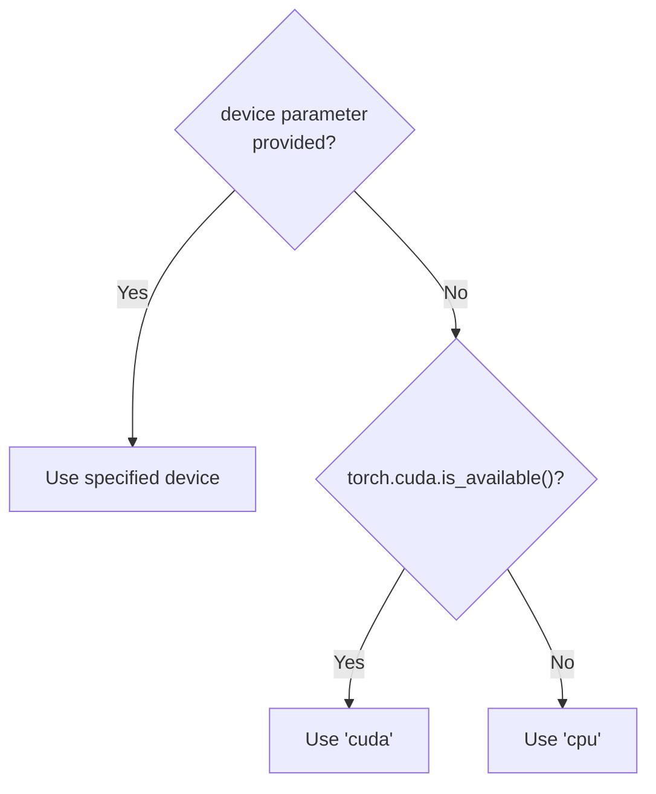

# Configuration

## Overview

fasta-embed uses a layered configuration system built on a Python `dataclass`. Configuration can come from three sources, applied in order of increasing precedence:

1. **Hardcoded defaults** — defined in `EmbedConfig` field defaults.
2. **YAML config file** — loaded via `--config config.yaml`.
3. **CLI flags** — any non-`None` value overrides both defaults and YAML.

---

## Precedence Diagram



### How Merging Works



The method returns a **new** `EmbedConfig` instance — the original is never mutated.

---

## Configuration Reference

| Key | CLI Flag | Type | Default | Description |
|---|---|---|---|---|
| `embedder` | `--embedder` | `str \| None` | `None` | Embedder backend name (`dnabert`, `ntv2`, `ntv3`). |
| `model_id` | `--model-id` | `str \| None` | `None` | HuggingFace model ID or local path. When `None`, each embedder uses its own default. |
| `input_file` | `--input` | `str` | `dna-sequences.fasta` | Path to the input FASTA or CSV/TSV file. |
| `input_format` | `--input-format` | `str \| None` | `None` | `"fasta"` or `"csv"`. Auto-detected from extension when `None`. |
| `output_file` | `--output` | `str` | `embedding.npy` | Path for the output NumPy `.npy` file. |
| `region` | `--region` | `str \| None` | `None` | 16S variable region to extract before embedding. `None` = full sequence. |
| `inference_batch_size` | `--inference-batch-size` | `int` | `16` | Number of sequences per model forward pass. |
| `device` | `--device` | `str \| None` | `None` | PyTorch device string (e.g. `cuda:0`, `cpu`). Auto-detected when `None`. |
| `csv_separator` | `--csv-separator` | `str` | `"\t"` | Column delimiter for CSV input. |
| `sequence_column` | `--sequence-column` | `str` | `"Seq"` | Column name containing DNA sequences (CSV only). |

---

## YAML Config File

The example configuration file (`config.example.yaml`) documents every available key:

```yaml
embedder: ntv3
model_id: null
input_file: dna-sequences.fasta
input_format: null
output_file: embedding.npy
region: null
inference_batch_size: 16
device: null
csv_separator: "\t"
sequence_column: Seq
```

Only keys matching `EmbedConfig` field names are loaded — unknown keys are silently ignored.

---

## Supported 16S Regions

When `region` is set, `bio.get_region()` extracts the corresponding variable region using PCR primer positions. If primers cannot be located, a fallback sequence `"ACGT"` is returned.



| Region | Forward Primer | Reverse Primer |
|---|---|---|
| V1V2 | 27F | 338R |
| V1V3 | 27F | 534R |
| V3V4 | 341F | 785R |
| V4 | 515F | 806R |
| V4V5 | 515F | 944R |
| V6V8 | 939F | 1378R |
| V7V9 | 1115F | 1492R |
| V1V8 | 27F | 1378R |
| V1V9 | 27F | 1492R |

---

## Device Auto-Detection

When `device` is `None`, each embedder resolves it at `load()` time:


