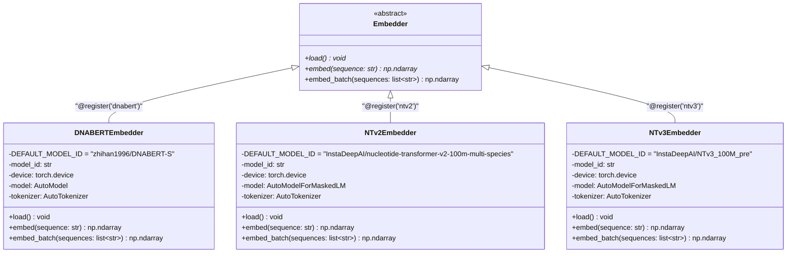
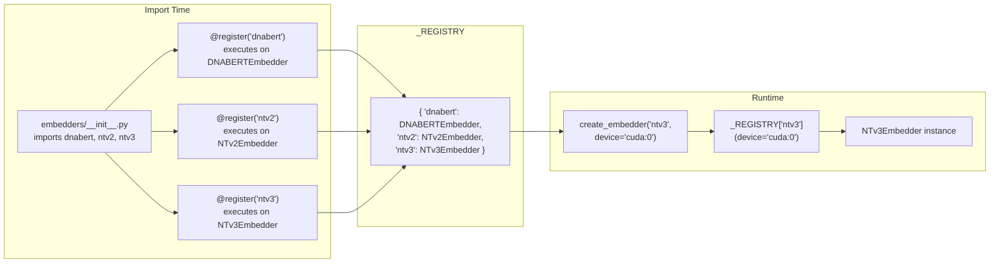
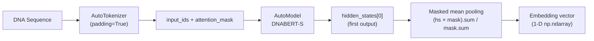
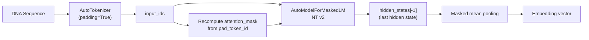
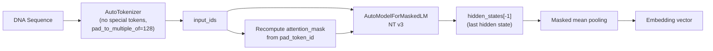

# Embedder System

## Overview

The embedder system provides a pluggable architecture for DNA sequence embedding models. It consists of three parts:

1. **Abstract interface** (`base.py`) — defines the contract all backends must fulfill.
2. **Registry** (`__init__.py`) — maps string names to concrete classes at runtime.
3. **Concrete backends** — each file implements one model family.

---

## Class Hierarchy

---

## Registry Pattern

The registry is a module-level dictionary `_REGISTRY: dict[str, type[Embedder]]` that maps names to classes. Registration happens at import time via a `@register` decorator.

### Registry API

| Function | Signature | Description |
|---|---|---|
| `register` | `register(name: str) → Callable` | Class decorator that adds an Embedder subclass to the registry. |
| `create_embedder` | `create_embedder(name: str, **kwargs) → Embedder` | Instantiates a registered embedder, forwarding kwargs to its constructor. |
| `list_embedders` | `list_embedders() → list[str]` | Returns sorted list of registered embedder names. |

---

## Built-in Backends

### DNABERT-S (`dnabert`)

| Property | Value |
|---|---|
| Default model | `zhihan1996/DNABERT-S` |
| Model class | `AutoModel` |
| Pooling | Mean pooling over first hidden state, masked by attention |
| Tokenization | Standard `AutoTokenizer` with padding |

### Nucleotide Transformer v2 (`ntv2`)

| Property | Value |
|---|---|
| Default model | `InstaDeepAI/nucleotide-transformer-v2-100m-multi-species` |
| Model class | `AutoModelForMaskedLM` |
| Pooling | Attention-mask-weighted mean pooling over last hidden state |
| Loading | Uses `device_map` for placement |

### Nucleotide Transformer v3 (`ntv3`)

| Property | Value |
|---|---|
| Default model | `InstaDeepAI/NTv3_100M_pre` |
| Model class | `AutoModelForMaskedLM` |
| Pooling | Same as NT v2 |
| Special | `add_special_tokens=False`, `pad_to_multiple_of=128` |
| Loading | Uses `device_map` for placement |

---

## Comparison Table

| Feature | DNABERT-S | NT v2 | NT v3 |
|---|---|---|---|
| Hidden state used | First (`[0]`) | Last (`[-1]`) | Last (`[-1]`) |
| Model API | `AutoModel` | `AutoModelForMaskedLM` | `AutoModelForMaskedLM` |
| Special tokens | Default | Default | Disabled |
| Padding strategy | Standard | Standard | Multiple of 128 |
| Attention mask source | Tokenizer output | Recomputed from `pad_token_id` | Recomputed from `pad_token_id` |
| `device_map` | Manual `.to(device)` | `{"": device}` | `{"": device}` |
| `output_hidden_states` | Not needed | `True` | `True` |
