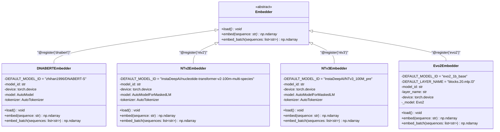
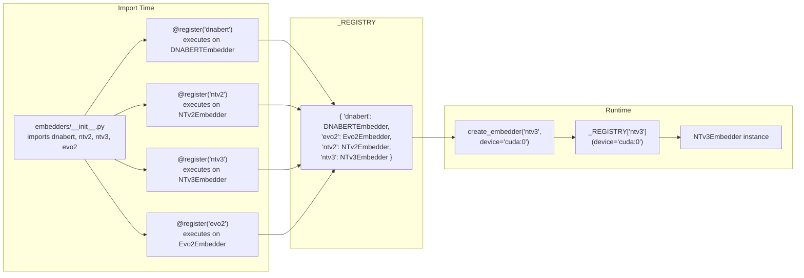
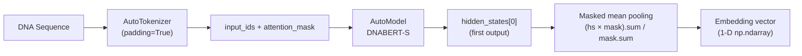
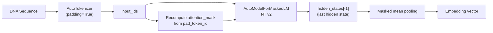
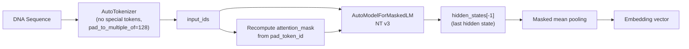
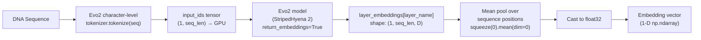

# Embedder System

## Overview

The embedder system provides a pluggable architecture for DNA sequence embedding models. It consists of three parts:

1. **Abstract interface** (`base.py`) — defines the contract all backends must fulfill.
2. **Registry** (`__init__.py`) — maps string names to concrete classes at runtime.
3. **Concrete backends** — each file implements one model family.

---

## Class Hierarchy



---

## Registry Pattern

The registry is a module-level dictionary `_REGISTRY: dict[str, type[Embedder]]` that maps names to classes. Registration happens at import time via a `@register` decorator.



### Registry API

| Function | Signature | Description |
|---|---|---|
| `register` | `register(name: str) → Callable` | Class decorator that adds an Embedder subclass to the registry. |
| `create_embedder` | `create_embedder(name: str, **kwargs) → Embedder` | Instantiates a registered embedder, forwarding kwargs to its constructor. |
| `list_embedders` | `list_embedders() → list[str]` | Returns sorted list of registered embedder names. |

---

## Built-in Backends

### DNABERT-S (`dnabert`)

| Property | Value |
|---|---|
| Default model | `zhihan1996/DNABERT-S` |
| Model class | `AutoModel` |
| Pooling | Mean pooling over first hidden state, masked by attention |
| Tokenization | Standard `AutoTokenizer` with padding |



### Nucleotide Transformer v2 (`ntv2`)

| Property | Value |
|---|---|
| Default model | `InstaDeepAI/nucleotide-transformer-v2-100m-multi-species` |
| Model class | `AutoModelForMaskedLM` |
| Pooling | Attention-mask-weighted mean pooling over last hidden state |
| Loading | Uses `device_map` for placement |



### Nucleotide Transformer v3 (`ntv3`)

| Property | Value |
|---|---|
| Default model | `InstaDeepAI/NTv3_100M_pre` |
| Model class | `AutoModelForMaskedLM` |
| Pooling | Same as NT v2 |
| Special | `add_special_tokens=False`, `pad_to_multiple_of=128` |
| Loading | Uses `device_map` for placement |



### Evo 2 (`evo2`)

| Property | Value |
|---|---|
| Default checkpoint | `evo2_1b_base` |
| Architecture | StripedHyena 2 (autoregressive, character-level) |
| Default layer | `blocks.20.mlp.l3` (~80 % network depth) |
| Pooling | Unmasked mean pooling over all sequence positions |
| Batching | Sequential (one sequence per forward pass) |
| GPU requirement | FP8 + Transformer Engine (Hopper GPU) for `1b_base` / `20b` / `40b`; bfloat16 for `7b` variants |
| Install | `pip install flash-attn==2.8.0.post2 --no-build-isolation && pip install evo2` |



> **Note:** Evo 2 is an autoregressive generative model (not masked-LM), so there is no padding mask. All token positions contribute equally to the mean pool. The `evo2` package must be installed separately — see the module docstring or [github.com/arcinstitute/evo2](https://github.com/arcinstitute/evo2) for full instructions.

#### Choosing a Layer

The Evo 2 paper demonstrates that intermediate layers produce better task-specific embeddings than the final layer. Layer names follow the pattern `blocks.{N}.mlp.l3`. A useful heuristic:

| Use case | Suggested depth |
|---|---|
| Sequence composition / motif features | ~50 % depth (earlier blocks) |
| Functional / taxonomic embeddings | ~80 % depth (default) |
| Generative likelihood features | ~95 % depth (near output) |

Override the default via the `layer_name` constructor parameter:

```python
from fasta_embed.embedders.evo2 import Evo2Embedder

embedder = Evo2Embedder(
    model_id="evo2_7b",
    device="cuda:0",
    layer_name="blocks.28.mlp.l3",  # ~90% depth for the 7B model
)
embedder.load()
```

#### Available Checkpoints

| Checkpoint | Parameters | Context | FP8 Required |
|---|---|---|---|
| `evo2_1b_base` | 1B | 8K | Yes (Hopper GPU) |
| `evo2_7b_base` | 7B | 8K | No |
| `evo2_7b` | 7B | 1M | No |
| `evo2_7b_262k` | 7B | 262K | No |
| `evo2_20b` | 20B | 1M | Yes |
| `evo2_40b` | 40B | 1M | Yes |

---

## Comparison Table

| Feature | DNABERT-S | NT v2 | NT v3 | Evo 2 |
|---|---|---|---|---|
| Architecture | BERT (encoder) | BERT (masked-LM) | BERT (masked-LM) | StripedHyena 2 (autoregressive) |
| Hidden state used | First (`[0]`) | Last (`[-1]`) | Last (`[-1]`) | Named intermediate layer |
| Model API | `AutoModel` | `AutoModelForMaskedLM` | `AutoModelForMaskedLM` | `Evo2` (custom) |
| Special tokens | Default | Default | Disabled | N/A (char-level) |
| Padding strategy | Standard | Standard | Multiple of 128 | None (sequential) |
| Attention mask source | Tokenizer output | Recomputed from `pad_token_id` | Recomputed from `pad_token_id` | Not used |
| Batch inference | True batched | True batched | True batched | Sequential |
| Install source | HuggingFace | HuggingFace | HuggingFace | `pip install evo2` |
