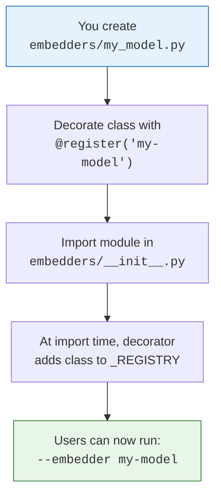
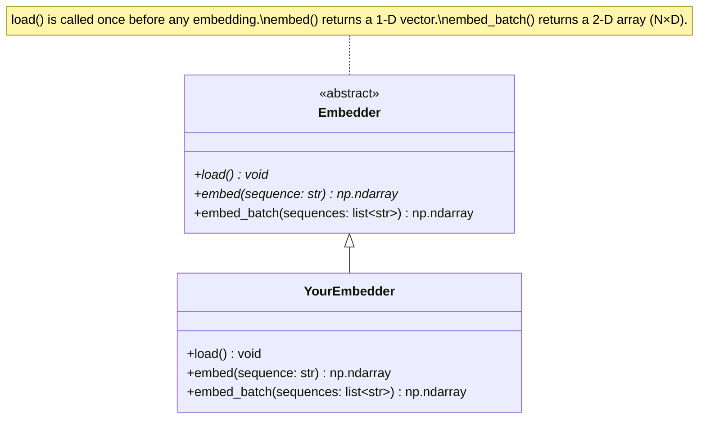
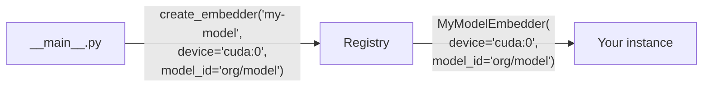

# Extending fasta-embed

This guide walks through adding a custom embedder backend to fasta-embed.

---

## How the Plugin System Works



The system relies on Python's import-time execution: when `embedders/__init__.py` imports your module, the `@register` decorator fires and inserts your class into the global `_REGISTRY` dictionary. No factory modifications, no config changes — just write, decorate, and import.

---

## Step-by-Step Guide

### 1. Create the Embedder File

Create a new file in `fasta_embed/embedders/`, for example `my_model.py`:

```python
from __future__ import annotations

import numpy as np
import torch
from transformers import AutoModel, AutoTokenizer

from . import register
from .base import Embedder


@register("my-model")
class MyModelEmbedder(Embedder):
    DEFAULT_MODEL_ID = "your-org/your-model-name"

    def __init__(
        self,
        model_id: str | None = None,
        device: str | None = None,
    ) -> None:
        self.model_id = model_id or self.DEFAULT_MODEL_ID
        self._device_request = device
        self.device: torch.device | None = None
        self.model = None
        self.tokenizer = None

    def load(self) -> None:
        self.device = torch.device(
            self._device_request
            or ("cuda" if torch.cuda.is_available() else "cpu")
        )
        self.tokenizer = AutoTokenizer.from_pretrained(
            self.model_id, trust_remote_code=True
        )
        self.model = AutoModel.from_pretrained(
            self.model_id, trust_remote_code=True
        ).to(self.device)

    def embed(self, sequence: str) -> np.ndarray:
        return self.embed_batch([sequence])[0]

    def embed_batch(self, sequences: list[str]) -> np.ndarray:
        tokens = self.tokenizer(
            sequences, padding=True, return_tensors="pt"
        )
        input_ids = tokens["input_ids"].to(self.device)
        attention_mask = tokens["attention_mask"].to(self.device)

        with torch.no_grad():
            outputs = self.model(
                input_ids, attention_mask=attention_mask
            )

        # Replace with your model's pooling strategy
        hidden = outputs.last_hidden_state
        mask = attention_mask.unsqueeze(-1)
        mean_emb = (hidden * mask).sum(dim=1) / mask.sum(dim=1)
        return mean_emb.cpu().numpy()
```

### 2. Register the Import

Add one line to `fasta_embed/embedders/__init__.py`:

```python
from . import my_model  # noqa: E402, F401
```

Place it alongside the existing imports at the bottom of the file.

### 3. Use It

```bash
# With CLI
python -m fasta_embed --embedder my-model --input sequences.fasta

# Or verify it shows up
python -m fasta_embed --list-embedders
```

---

## The Embedder Contract

Your class must satisfy the `Embedder` abstract interface:



### Required Methods

| Method | Return Type | When Called | What to Do |
|---|---|---|---|
| `load()` | `None` | Once, before any embedding work | Load model weights, tokenizer, set up device. |
| `embed(sequence)` | `np.ndarray` (1-D) | Per single sequence (or delegate to `embed_batch`) | Tokenize, run forward pass, pool, return vector. |

### Optional Override

| Method | Default Behavior | When to Override |
|---|---|---|
| `embed_batch(sequences)` | Loops over `embed()` and stacks with `np.vstack` | When your backend supports batched inference (GPU models, API calls). |

---

## Constructor Convention

All built-in embedders follow the same constructor signature:

```python
def __init__(
    self,
    model_id: str | None = None,
    device: str | None = None,
) -> None:
```

This is not enforced by the ABC, but `__main__.py` passes `device` and optionally `model_id` as keyword arguments via `create_embedder()`. Following this convention ensures your embedder works with the CLI without modifications.



---

## Checklist

Before shipping a new embedder, verify:

- [ ] Class is decorated with `@register("unique-name")`
- [ ] Module is imported in `embedders/__init__.py`
- [ ] Constructor accepts `model_id: str | None` and `device: str | None`
- [ ] `load()` initializes model, tokenizer, and resolves device
- [ ] `embed()` returns a 1-D `np.ndarray`
- [ ] `embed_batch()` returns a 2-D `np.ndarray` of shape `(N, D)`
- [ ] `embed_batch()` uses `torch.no_grad()` for inference
- [ ] Device tensors are moved back to CPU before converting to NumPy
- [ ] `--list-embedders` shows the new name
- [ ] A test run completes: `python -m fasta_embed --embedder my-model --input test.fasta`

---

## Non-Transformer Backends

The `Embedder` interface is not limited to HuggingFace transformer models. You can wrap any embedding source:

- **k-mer frequency vectors** — count k-mers in `embed()`, no model loading needed.
- **REST API backends** — call an external service in `embed_batch()`, use `load()` to configure the HTTP client.
- **Pre-computed lookup** — load a dictionary in `load()`, return cached vectors in `embed()`.

The only requirements are that `embed()` returns a 1-D `np.ndarray` and `embed_batch()` returns a 2-D `np.ndarray` with a consistent embedding dimension across all sequences.
