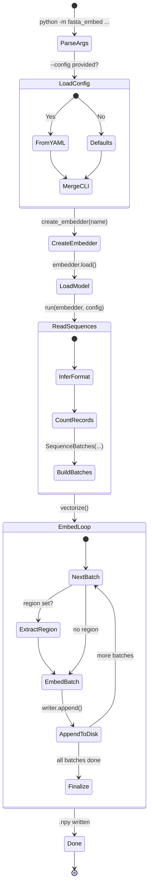
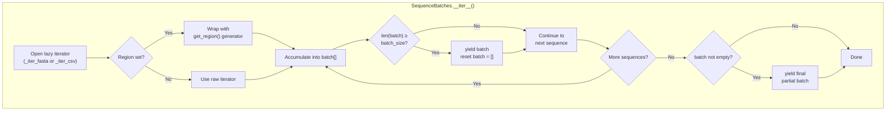
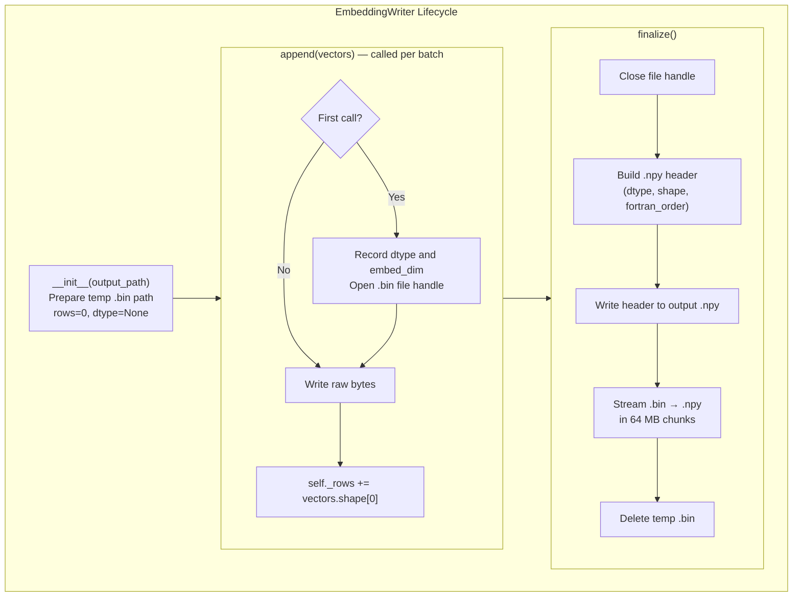

# Pipeline & Data Flow

## Overview

The fasta-embed pipeline transforms raw DNA sequence files into a dense embedding matrix stored as a NumPy `.npy` file. The process is orchestrated by `pipeline.py`, which coordinates sequence I/O (`io.py`), optional biological preprocessing (`bio.py`), and model inference (the `Embedder` backend).

---

## End-to-End Data Flow

```mermaid
flowchart LR
    subgraph Input
        FASTA["FASTA file<br/><code>.fasta / .fa / .fna</code>"]
        CSV["CSV / TSV file<br/><code>.csv / .tsv</code>"]
        GZ["Gzipped variants<br/><code>*.gz</code>"]
    end

    subgraph "Format Detection"
        INFER["_infer_format()<br/>Extension-based<br/>detection"]
    end

    subgraph "Counting Pass"
        COUNT_F["_count_fasta()<br/>Count '>' lines"]
        COUNT_C["_count_csv()<br/>Count rows − 1"]
    end

    subgraph "Lazy Iteration"
        ITER_F["_iter_fasta()<br/>BioPython SeqIO"]
        ITER_C["_iter_csv()<br/>pandas chunked reader"]
    end

    subgraph "Region Extraction"
        BIO["get_region()<br/>Primer-based 16S<br/>subsequence extraction"]
    end

    subgraph "Batching"
        BATCH["SequenceBatches<br/>Groups sequences into<br/>lists of batch_size"]
    end

    subgraph "Embedding"
        EMB["Embedder.embed_batch()<br/>Tokenize → Forward pass<br/>→ Mean pooling"]
    end

    subgraph "Persistence"
        WRITER["EmbeddingWriter<br/>Append raw bytes<br/>to temp .bin file"]
        NPY["finalize()<br/>Stream .npy header<br/>+ 64 MB data chunks"]
    end

    subgraph Output
        FILE[("embeddings.npy<br/>Shape: N × D")]
    end

    FASTA --> INFER
    CSV --> INFER
    GZ --> INFER

    INFER -->|fasta| COUNT_F
    INFER -->|csv| COUNT_C

    COUNT_F --> ITER_F
    COUNT_C --> ITER_C

    ITER_F --> BIO
    ITER_C --> BIO
    BIO --> BATCH

    BATCH -->|"list[str]"| EMB
    EMB -->|"np.ndarray (B×D)"| WRITER
    WRITER --> NPY
    NPY --> FILE
```

> Region extraction is optional — when no `--region` is specified, sequences flow directly from the iterators into batching.

---

## Pipeline Execution Stages

---

## Sequence Batching Detail

`SequenceBatches` is the central data structure connecting I/O to model inference. It wraps a lazy iterator and groups sequences into fixed-size lists.

---

## Embedding Persistence Detail

`EmbeddingWriter` is designed for constant peak memory regardless of dataset size.

### Why Two-File Streaming?

NumPy's `.npy` format requires the array shape in its header, but the total number of sequences is unknown until all batches are processed. Writing raw bytes to a temp file first allows the header to be computed at the end, while keeping memory usage at O(batch_size) instead of O(dataset_size).

---

## Supported Input Formats

| Format | Extensions | Gzip Support | Reader |
|---|---|---|---|
| FASTA | `.fasta`, `.fa`, `.fna`, `.fas` | Yes (`.fasta.gz`, etc.) | BioPython `SeqIO.parse` |
| CSV / TSV | `.csv`, `.tsv`, `.txt` | Yes (`.csv.gz`, etc.) | `pandas.read_csv` with `chunksize=10_000` |

Format is auto-detected from the file extension (stripping `.gz` first). It can be explicitly set via `--input-format`.
